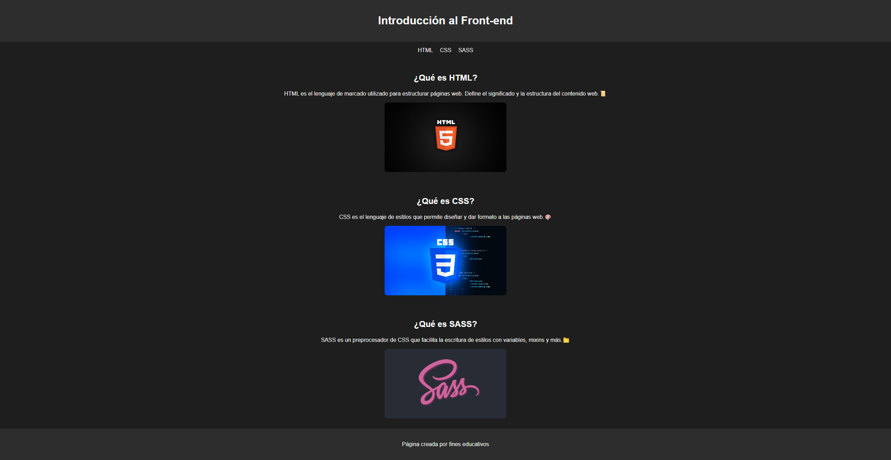

# Proyecto: Front-end Básico

Este es un proyecto web minimalista sobre conceptos básicos de desarrollo Front-end, utilizando HTML, CSS y SASS. El diseño tiene una estética oscura con efectos visuales atractivos.

## Tecnologías utilizadas

- **HTML**: Para la estructura de la página.
- **CSS (SASS)**: Para los estilos y modularidad de los componentes.

## Características principales

- **Diseño minimalista y oscuro**
- **Efectos de hover en imágenes y enlaces**
- **Animaciones sutiles para una experiencia más fluida**
- **Uso de variables**

## Captura de pantalla

